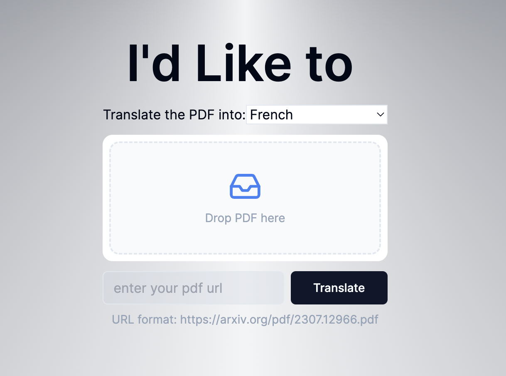
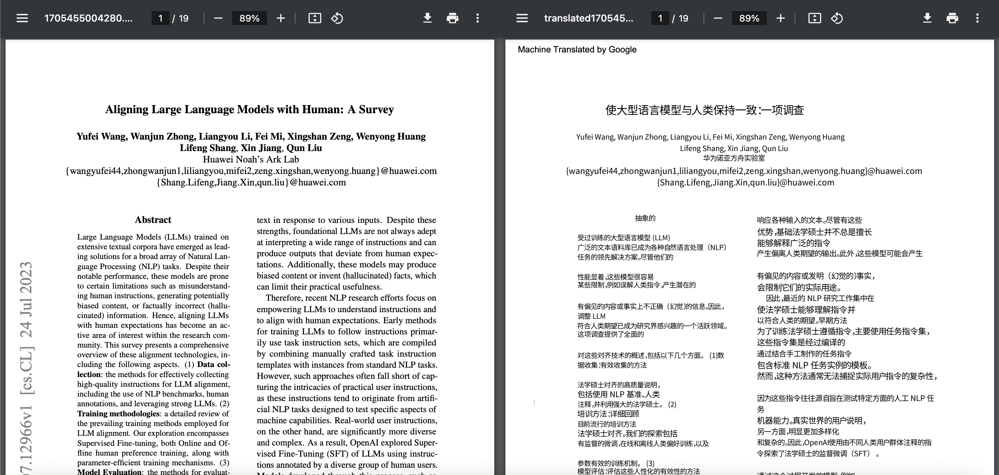
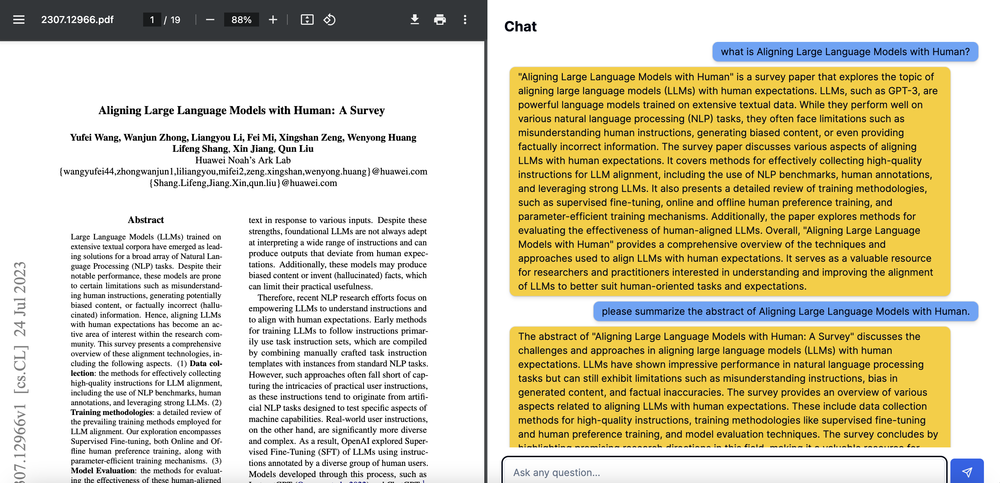

# Chat-Translate PDFs

This is a web application where you can chat with or translate your PDFs.  Ask questions about, summarizing part or whole of the PDFs, ChatGPT on the backend will answer them.  You can also translate your PDFs into other languages.

There are two ways to upload you PDFs, you can drop you file directly from you computer or you can paste the PDF URL, for example, https://arxiv.org/pdf/2307.12966.pdf.  Note the URL has to start with http and end with .pdf.



### Translate

You can select the language you'd like to translate your PDFs into.  The translation is powered by [Google Translation API](https://cloud.google.com/translate/docs/reference/rest).



### Chat

Ask questions about, summarizing part or whole of the PDFs, ChatGPT on the backend will answer them. The chat is powered by [OpenAI API](www.openai.com), with gpt-3.5-turbo" model.



--------------

The project is built only with [Next.js](https://nextjs.org/).  And it is deployed on [Vercel](www.vercel.com).

[check it out](https://chat-translate-pdf.vercel.app/).

The following content was generated by `create-next-app`.

--------------

This is a [Next.js](https://nextjs.org/) project bootstrapped with [`create-next-app`](https://github.com/vercel/next.js/tree/canary/packages/create-next-app).

## Getting Started

First, run the development server:

```bash
npm run dev
# or
yarn dev
# or
pnpm dev
# or
bun dev
```

Open [http://localhost:3000](http://localhost:3000) with your browser to see the result.

You can start editing the page by modifying `app/page.tsx`. The page auto-updates as you edit the file.

This project uses [`next/font`](https://nextjs.org/docs/basic-features/font-optimization) to automatically optimize and load Inter, a custom Google Font.

## Learn More

To learn more about Next.js, take a look at the following resources:

- [Next.js Documentation](https://nextjs.org/docs) - learn about Next.js features and API.
- [Learn Next.js](https://nextjs.org/learn) - an interactive Next.js tutorial.

You can check out [the Next.js GitHub repository](https://github.com/vercel/next.js/) - your feedback and contributions are welcome!

## Deploy on Vercel

The easiest way to deploy your Next.js app is to use the [Vercel Platform](https://vercel.com/new?utm_medium=default-template&filter=next.js&utm_source=create-next-app&utm_campaign=create-next-app-readme) from the creators of Next.js.

Check out our [Next.js deployment documentation](https://nextjs.org/docs/deployment) for more details.
